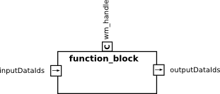

Function blocks for the BRICS_3D library
==========================================================

Overview
--------

A `function block` is a computational entity that performs an arbitrary
computation on the data stored in a world model based on the
`Robot Scene Graph (RSG)`. It consumes and produces scene graph
elements. Algorithms for estimating near future states are
one example of such a computation. A function block can
be loaded as a plugin to the RSG and is executed
on demand. This allows to move the computation near to
the data to improve efficiency of the executed computations.

The current implementation of the RSG is part of the BRICS_3D library.

 

* All elements in the RSG are uniquley adressable via thier IDs. 
  These IDs serve as input and output for a function block. 
  The ports called `inputDataIds` and `outputDataIds` are used to transfere 
  this information.
  
  Multibple function blocks can be chained up if the output port of one block is connected with
  the input port of another function block. This allows to create processing chains by combining 
  individual of function blocks.
   
* To obtain access to the data of the handle of world model is passes as 
 configuration parameter `wm_handle`. This handle is not supposed to change during runtime.   


Dependencies
------------

 - BRICS_3D library. Installation instructions can be found here: http://www.best-of-robotics.org/brics_3d/installation.html
 - microblx library. See: https://github.com/kmarkus/microblx

Here is a summuary on how to install microblx on Ubuntu (12.04)

Dependencies:
```
	sudo apt-get install clang

	wget luajit.org/download/LuaJIT-2.0.2.tar.gz
	tar -xvf LuaJIT-2.0.2.tar.gz 
	cd LuaJIT-2.0.2
	make
	sudo make install
	sudo ln -s /usr/local/bin/luajit /usr/local/bin/lua
	sudo ldconfig
```

Installation of the actual microblx library:
```
	git clone https://github.com/kmarkus/microblx.git
	git checkout dev # you might want to skip this step
	cd microblx
	source env.sh 
	make
	echo "export UBX_ROOT=$PWD" >> ~/.bashrc
```

Compilation
-----------

```
 $ mkdir build
 $ cd build 
 $ cmake .. -DCMAKE_CXX_COMPILER=/usr/bin/clang++
 $ make 
```

Usage
-----

To start the example do the following:

```
sh start_demo.sh 
```

The system will be _initialized_. To actually _start_ it go to the web interface at 
localhost:8888 and click on all dark green _start_ buttons.


Licensing
---------

This software is published under a dual-license: GNU Lesser General Public
License LGPL 2.1 and Modified BSD license. The dual-license implies that
users of this code may choose which terms they prefer. Please see the files
called LGPL-2.1 and BSDlicense.


Impressum
---------

Written by Sebastian Blumenthal (blumenthal@locomotec.com)
Last update: 06.06.2014
 


